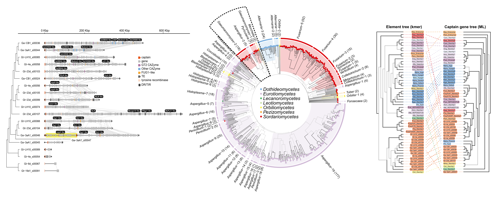

# Kmer-based phylogenetic classification of *Starship* cargo-mobilising transposable elements

<picture>
  
</picture>

Bioinformatics workflow for:
> Hill et al. (in prep) ***

The pipeline was written for and run on Norwich BioScience Institutes' HPC cluster which uses the SLURM batch-queue system. This means that the bash scripts (`.sh` file endings) specify core allocation, run times and memory usage allocation that may need to be adapted for different platforms.

Input data was sourced from [Hill et al. (2024)](), [Gluck-Thaler et al. (2022)](https://doi.org/10.1093/molbev/msac109) and [Gluck-Thaler et al. (2024)](https://doi.org/10.1093/nar/gkae327).

---

## Element classification

1. `sbatch 01_mashtree_curated.sh` builds a phylogenetic tree from a curated set of *Starship* elements using [mashtree](https://github.com/lskatz/mashtree), with 1,000 bootstrap replicates and `--mindepth 0` for greater accuracy.
2. `sbatch 02_align_cap.sh` aligns element captain genes using MAFFT and trims alignments using [trimAl](https://github.com/inab/trimal), with parameters set to match [Gluck-Thaler et al. (2024)](https://doi.org/10.1093/nar/gkae327).
3. `sbatch 03_raxmlng_cap.sh` builds an ML gene tree for captain genes using [RAxML-NG](https://github.com/amkozlov/raxml-ng) with bootstrapping until convergence or up to 1,000 replicates (whichever first).
4. `sbatch 04_mashtree_big.sh` builds a phylogenetic tree from a wider set of *Starship* elements (predicted using [starfish](https://github.com/egluckthaler/starfish) by [Gluck-Thaler et al. (2024)](https://doi.org/10.1093/nar/gkae327)) using mashtree, with 100 bootstrap replicates.

Script to plot figures: `plot_trees.R`

## Element cargo 

7. `sbatch 07_blast.sh` searches for previously reported genes in *Gaeumannomyces* element cargos using [BLAST](https://blast.ncbi.nlm.nih.gov/Blast.cgi).

Script to plot figures: `plot_cargo.R`

## Citation

> Hill et al. (in prep) ***
